# The entrance, before and after

Frames from card 02, at 1728×996. The wall-clock ones are timed from the moment
the hash changes to `#view-02` — a real open, clicked from the grid, not a seek.
Captured by `.context/paper-roll/shots.mjs`, `verify-open.mjs`,
`verify-exit.mjs` and `strip.mjs`; the full-size PNGs and the tear frames at
both device pixel ratios stay in `.context`, which is not committed.

## What was wrong

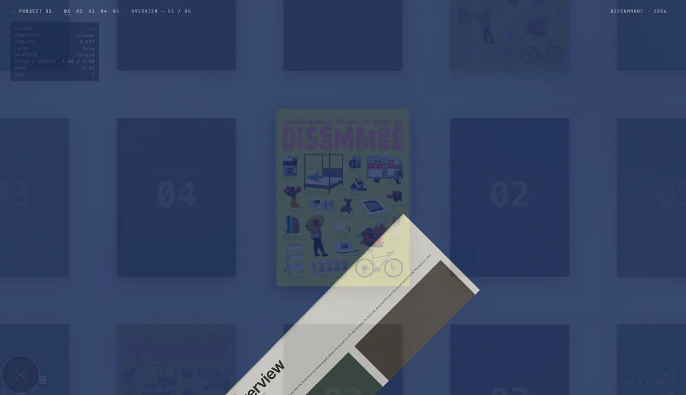

**0.25s after the open, before this change.** A flat sheet at −45° with a crease
in one corner. The entrance was drawing the TEAR's shape: the first release's
roll numbers had been set into the arc-fold formula that replaced it, and the
two read the same parameter names to mean different things. Nothing failed — the
pose was correct throughout.

## What ships

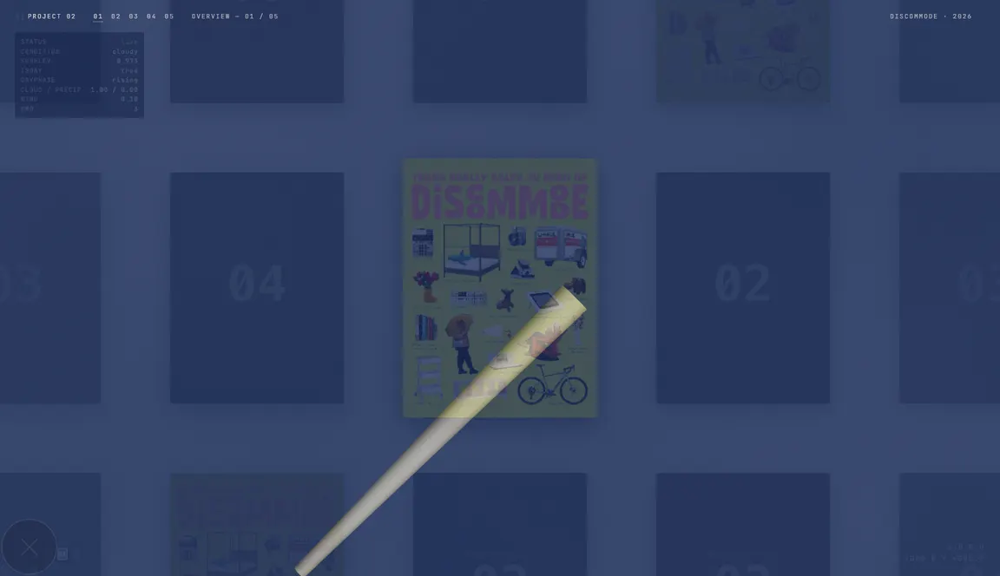

**0.25s.** The sheet is wound into a tube — the cone wrap, recovered from the
first paper release.

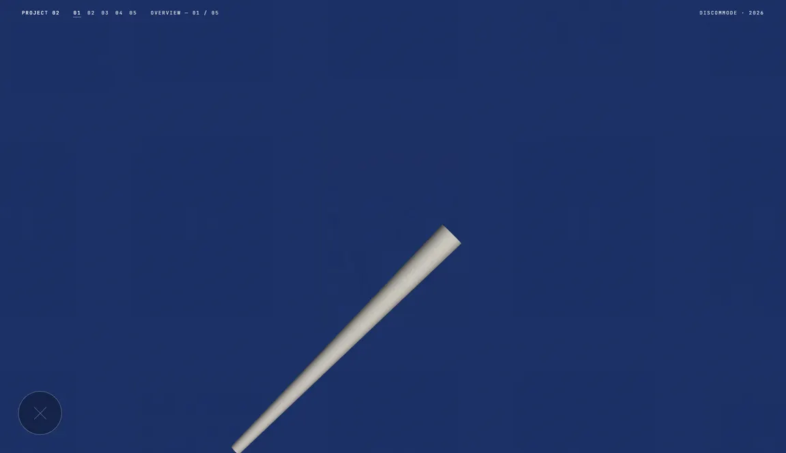

**0.5s.** The ground has arrived; the sheet is still fully rolled. The unroll has
not started.

> These four frames are from the build that recovered the roll, when the open
> tween was `riseDelayMs` 500 + `riseMs` 900. The tune below lengthened it; the
> shapes are the same and the clock is not. Read the timings under
> **The open, paced** for what ships.

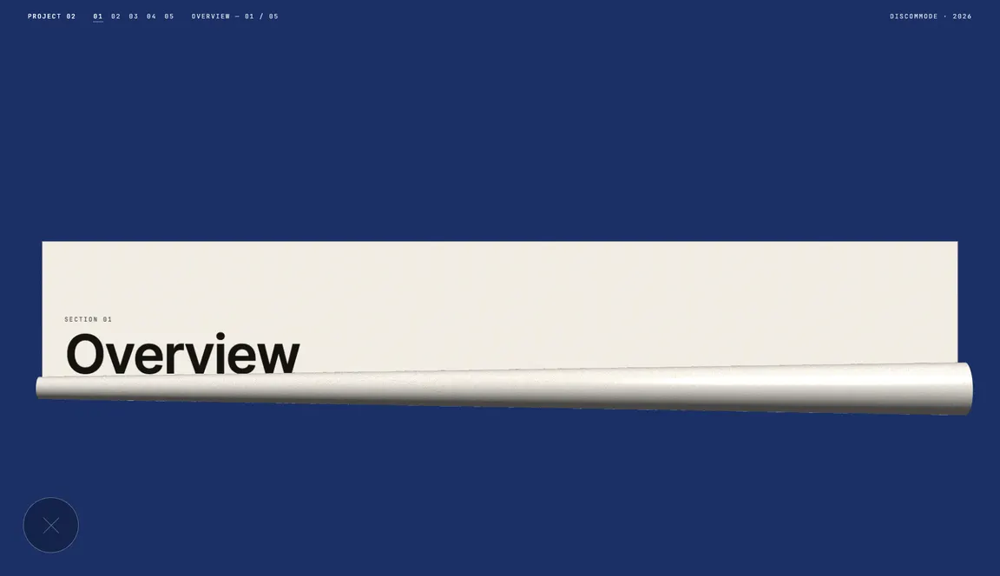

**0.62s — the unroll.** A tube along the bottom edge with the flat page above it
and the title already readable. This is the frame the change is for.

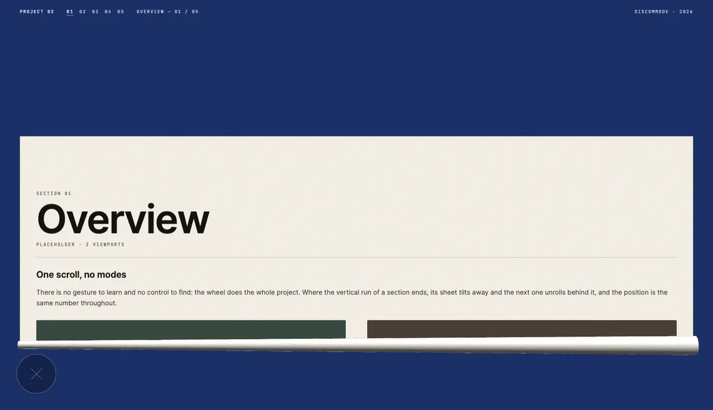

**0.68s.** Most of the way out, the tube thinning as it goes — its radius is
derived from a fixed number of turns, so it shrinks to nothing rather than
collapsing through a discontinuity.

## The open, paced — and arriving from below the frame

The four frames above are the right shapes at the wrong speed and in the wrong
place: at 1.4s the tube was gone before the eye had found it, and it was simply
THERE when the ground arrived rather than coming from anywhere.

The open now runs `openDelayMs` 400 + `openRiseMs` 2600 — **from the click**,
not from the moment the track arms — through a curve of its own. `EASE.open` is
the rhythm and `OPEN_TRACK` is what the time buys: the rise and the hold over
the first 30%, the unroll over the next 45%, the settle to the end. The sheet
starts with its top edge `openStartBelowPx` (40) under the bottom of the frame,
at a depth computed from the live page rect.

These six are **timed from the click**, at 2×, and they are what ships.

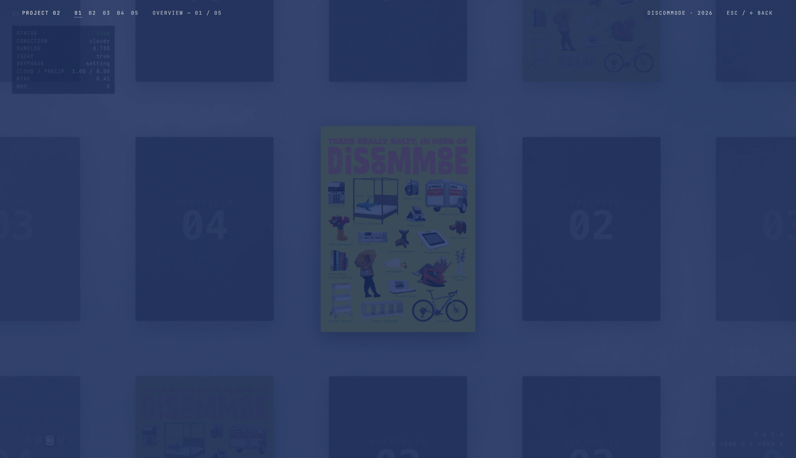

**0.2s.** Bare ground. The sheet is below the frame — the letterhead has
arrived, and it is the only thing on screen.

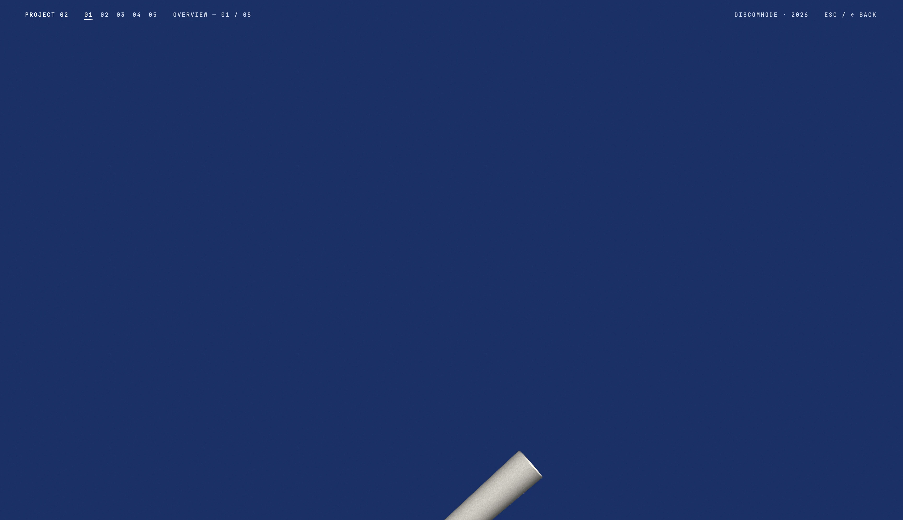

**0.6s.** The tube's tip, entering at the bottom edge, still turned to −45°.
Measured: the first sheet pixel to appear is 950px down a 996px viewport.

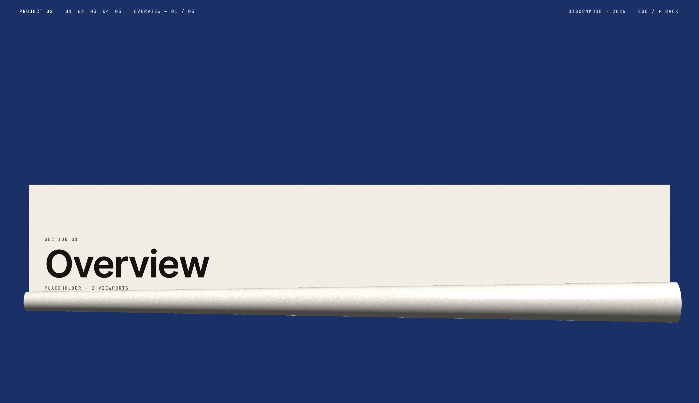

**1.0s.** In frame and climbing, square now, just starting to open. The taper
reads — the cone coils tighter at one end than the other.

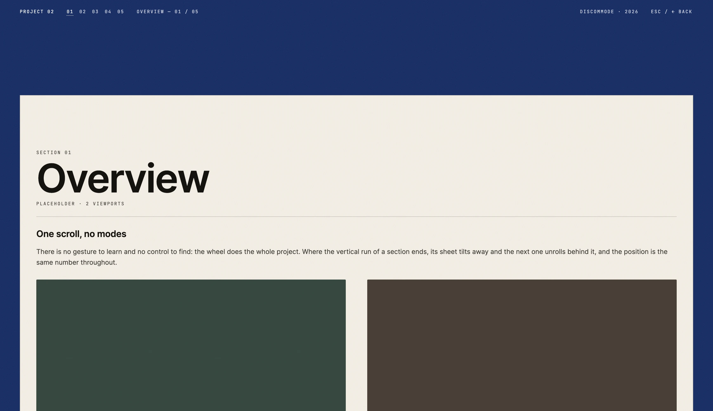

**1.6s.** Flat, sharp, still rising into the page's rect.

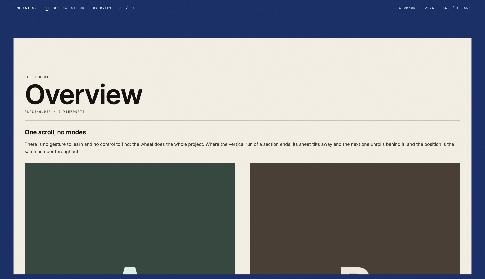

**2.2s.** All but docked.

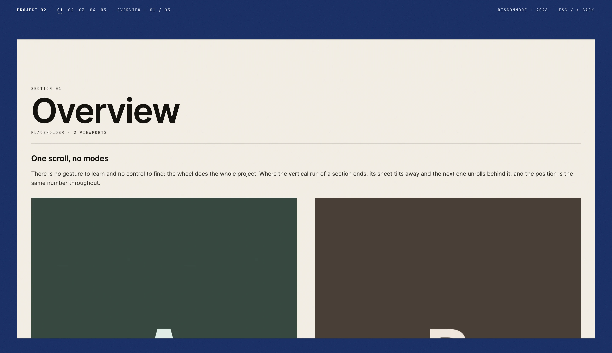

**2.6s.** Docked; the hand-off takes it from here.

No frame over 20ms through the tween (worst 16.8ms over 157 frames), and no
`.pv-page` pixel paints before the hand-off — the canvas is the first surface in
the paint order.

**And it can be cut short.** Three seconds is a long time to hold someone who
has already reached for the wheel, so the first wheel or touch retargets the
tween to finish in 350ms from wherever it had got to — the same `OPEN_TRACK`
mapping, run faster. Measured with the wheel at 0.82s: docked at 1.21s, first
frame of the retarget 1px (a plain ease-out puts 310px there), no frame over
20ms.

Note what is NOT in these frames: the close pill. It and the 144px band of
ground it sat in are gone, and the way out is `ESC / ← BACK` at the right end of
the letterhead.

## What did not change

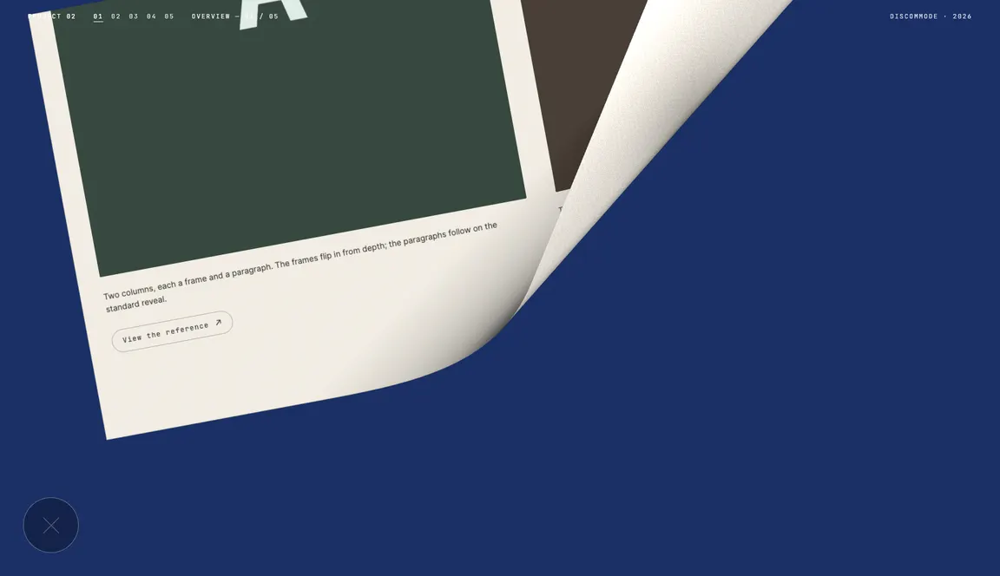

**The tear at `p` = 0.5.** Byte-for-byte identical to the previous build — same
SHA-256, at `p` = 0.15, 0.5 and 0.7, at 1× and 2×. The exit is on its own shader
program, which is the one that shipped, character for character. See
`docs/portfolio-view.md` on why the switch is a program and not a uniform.

**And the scroll-driven entrances.** The open's pacing is a re-mapping of TIME
and its start is a depth no other entrance is given, so every entrance the wheel
drives is untouched: SHA-256 of section 1's entrance at `p` = 0.1 / 0.4 / 0.8,
captured with the open tune reverted and again with it restored, is identical at
all three points.

(Those hashes are not the ones from the previous release, and they should not
be: the page rect is 96px taller now that the close pill's band has gone, so
every pixel of every page moved. That is the pill's doing, not the tween's —
which is exactly why the A/B reverts the tween alone and leaves the rect where
it is.)
